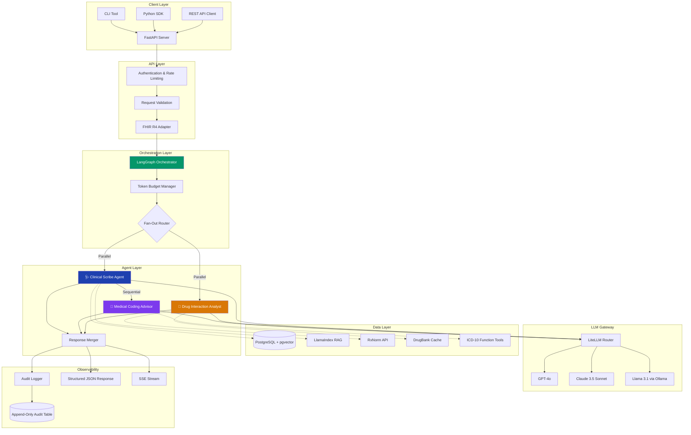
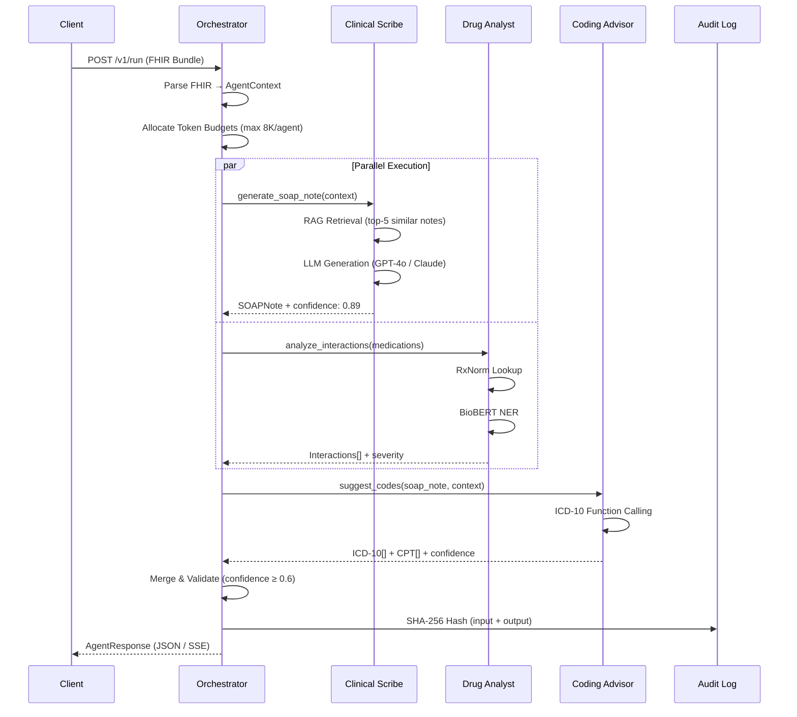
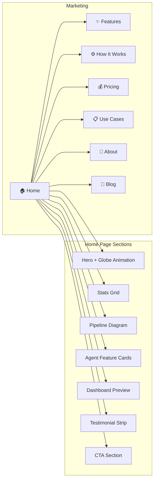
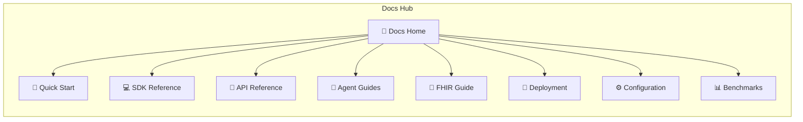
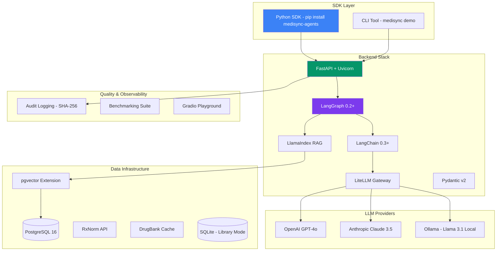
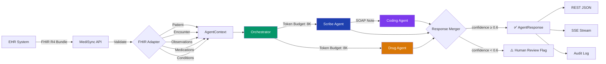
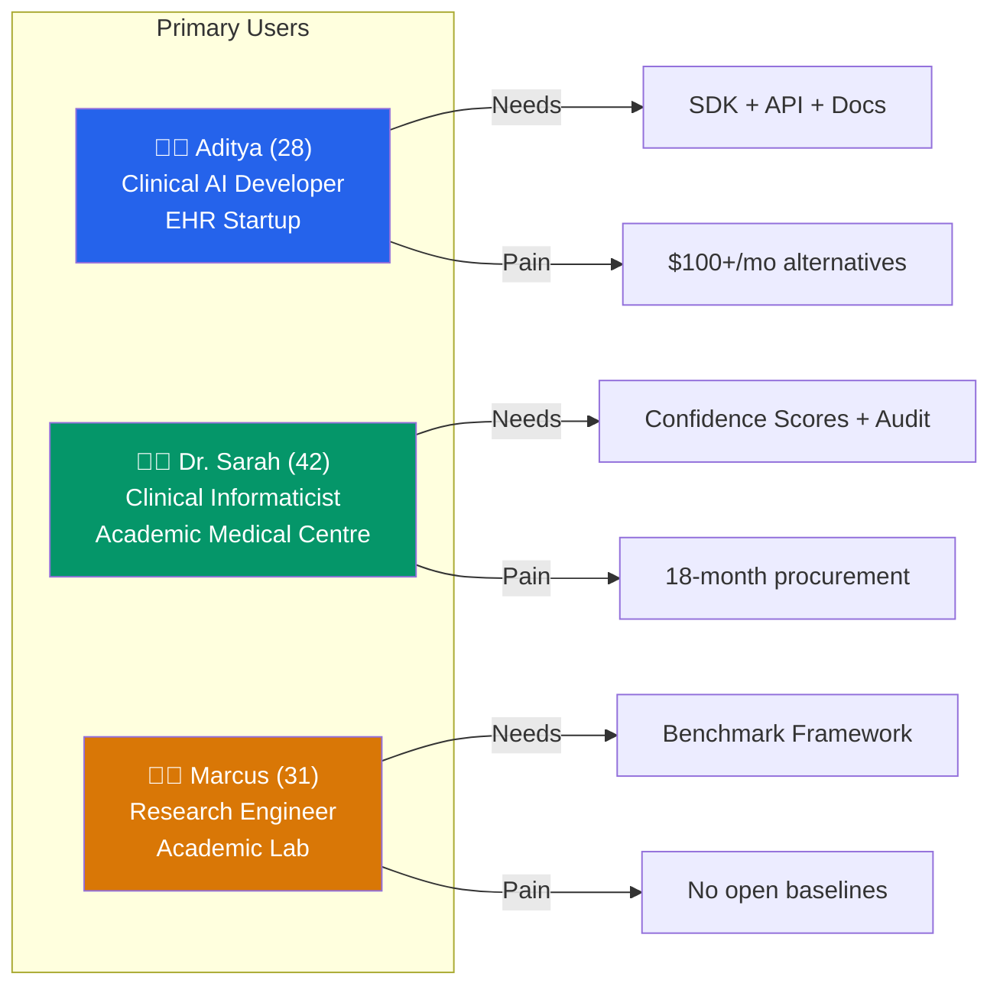
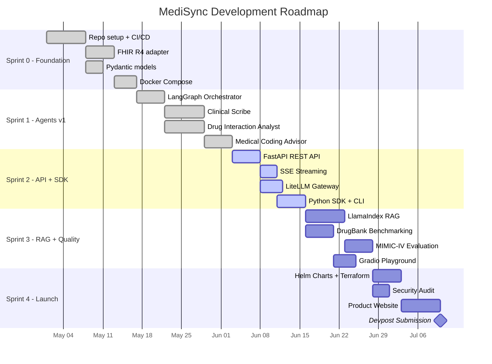

<div align="center">

# 🧬 MediSync

### Multi-Agent EHR Copilot for Clinical Documentation

[](LICENSE)
[](https://react.dev)
[](https://vite.dev)
[](CONTRIBUTING.md)
[](https://devseason.com)

**Three AI agents — Clinical Scribe, Drug Interaction Analyst, and Medical Coding Advisor — collaborate in real time to automate clinical documentation, powered by an open-source, pip-installable Python SDK.**

[🌐 Live Demo](https://medisync-website-new.vercel.app/) · [📖 Documentation](#-documentation) · [🎮 Playground](#-interactive-tools) · [🤝 Contributing](#-contributing)

---

</div>

## 📋 Table of Contents

- [Problem Statement](#-problem-statement)
- [Product Vision](#-product-vision)
- [System Architecture](#-system-architecture)
- [Agent Architecture](#-agent-architecture)
- [Tech Stack](#-tech-stack-website)
- [Pages & Features](#-pages--features)
- [SDK Tech Stack](#-sdk-tech-stack)
- [API Specification](#-api-specification)
- [Data Flow](#-data-flow)
- [Benchmarks](#-benchmarks--metrics)
- [User Personas](#-user-personas)
- [Sprint Roadmap](#-sprint-roadmap)
- [Getting Started](#-getting-started)
- [Project Structure](#-project-structure)
- [Contributing](#-contributing)
- [License](#-license)

---

## 🔴 Problem Statement

| Metric | Impact |
|--------|--------|
| **16 hrs/week** | Time physicians spend on documentation instead of patient care |
| **$125B/year** | Cost of clinical documentation burden in the US healthcare system |
| **52%** | Physician burnout rate attributed to administrative overhead |
| **Zero** | Open-source, developer-friendly SDK options for clinical AI agents |

> Physicians spend more time documenting than caring for patients. Commercial solutions like **Nuance DAX** ($100+/physician/month) and **Suki** are closed-source, expensive, and offer no SDK for developers. There is no open-source, pip-installable multi-agent SDK for clinical documentation.

---

## 🎯 Product Vision

> _To build the de-facto open-source SDK for clinical AI agents — enabling any developer to embed multi-agent clinical documentation intelligence into any EHR system in under 60 minutes._

MediSync provides:
- 🩺 **SOAP note generation** from FHIR encounters with confidence scoring
- 💊 **Drug interaction detection** via RxNorm + BioBERT with severity classification
- 🏥 **ICD-10/CPT coding suggestions** ranked by confidence with payer-specific notes
- 📡 **Unified REST API + Python SDK** with SSE streaming support
- 🔒 **Full audit logging** with SHA-256 input/output hashing for compliance

---

## 🏗 System Architecture



---

## 🤖 Agent Architecture

### Agent Pipeline Flow



### Agent Detail Cards

| Agent | Purpose | Tech Stack | Accuracy Target |
|-------|---------|------------|-----------------|
| 🩺 **Clinical Scribe** | SOAP note generation from encounter context | LLM + LlamaIndex RAG + MIMIC-III | Physician Score ≥ 4.2/5.0 |
| 💊 **Drug Interaction Analyst** | Medication cross-referencing with severity | RxNorm + BioBERT NER + pgvector | Recall ≥ 94% on DrugBank |
| 🏥 **Medical Coding Advisor** | ICD-10-CM & CPT code suggestions | GPT-4o Function Tools + ICD-10 DB | Top-3 Accuracy ≥ 88% |

---

## 🛠 Tech Stack (Website)

| Layer | Technology | Purpose |
|-------|-----------|---------|
| **Build** | Vite 6 | Lightning-fast HMR & optimized builds |
| **Framework** | React 19 | Component-based UI with concurrent features |
| **Routing** | React Router v7 | Client-side SPA routing with 25 routes |
| **Animation** | Framer Motion | Page transitions, scroll animations, micro-interactions |
| **Icons** | Lucide React | 1000+ consistent open-source icons |
| **Styling** | Vanilla CSS | Custom design system with CSS custom properties |
| **Typography** | Inter + JetBrains Mono | UI text + monospace code blocks |
| **Code Highlighting** | Prism.js | Syntax highlighting for code examples |

### Design System

```
Color Palette:
  Background:    #0a0f1c (Brand Navy)     — Page background
  Surface:       #0d2141 (Brand Midnight)  — Cards, panels
  Primary:       #2563EB (Electric Blue)   — CTAs, links, active states
  Accent:        #7C3AED (Violet)          — Secondary highlights
  Success:       #059669 (Emerald)         — Positive states
  Warning:       #D97706 (Amber)           — Caution states
  Critical:      #E11D48 (Rose)            — Error states

Typography:
  Display:       4.5rem / 800 weight       — Hero headlines
  H1:            2.5rem / 700 weight       — Section titles
  Body:          1rem / 400 weight         — Paragraph text
  Code:          JetBrains Mono            — All code blocks

Effects:
  Glassmorphism: backdrop-filter: blur(16px) + rgba borders
  Hover:         translateY(-4px) + enhanced glow shadow
  Transitions:   200ms ease (fast) / 500ms ease (base)
```

---

## 📄 Pages & Features

### 🌐 Marketing Site (7 pages)



| Page | Route | Key Features |
|------|-------|-------------|
| **Home** | `/` | Animated hero, social proof stats, agent pipeline diagram, dashboard mockup, testimonials |
| **Features** | `/features` | Deep-dive agent cards with sample JSON output, comparison table (MediSync vs Nuance vs Suki) |
| **How It Works** | `/how-it-works` | 5-step pipeline walkthrough, ASCII sequence diagram, latency benchmarks, FAQ accordion |
| **Pricing** | `/pricing` | $0 forever card, 3 self-hosting options, local vs cloud LLM comparison |
| **Use Cases** | `/use-cases` | 4 persona-driven scenario cards (startups, academia, international, research) |
| **About** | `/about` | Origin story, core values, team section, sprint roadmap timeline |
| **Blog** | `/blog` | Tag-filtered article grid, featured post, 6 demo articles |

### 📖 Documentation (9 pages)



| Page | Route | Key Features |
|------|-------|-------------|
| **Docs Home** | `/docs` | Navigation hub with card grid, Quick Start hero, GitHub Codespaces button |
| **Quick Start** | `/docs/quickstart` | 5-step guide (install → demo → API call → SDK usage), troubleshooting FAQ |
| **SDK Reference** | `/docs/sdk` | Searchable class/method listing (MediSyncClient, AgentContext, AgentResponse, RunConfig) |
| **API Reference** | `/docs/api` | 9 expandable endpoint cards with request/response schemas, status codes |
| **Agent Guides** | `/docs/agents` | Tabbed deep-dive per agent (inputs, output schema, confidence scoring, customisation) |
| **FHIR Guide** | `/docs/fhir` | FHIR R4 resource table, example Bundle JSON, validation rules, de-identification |
| **Deployment** | `/docs/deployment` | 3 tabbed tracks: Local Docker, Cloud Kubernetes, Library Mode (air-gapped) |
| **Configuration** | `/docs/config` | 23 searchable config options across 7 categories |
| **Benchmarks** | `/docs/benchmarks` | SOAP quality, ICD-10 accuracy, drug recall, latency metrics with progress bars |

### 🎮 Interactive Tools (3 pages)

| Page | Route | Key Features |
|------|-------|-------------|
| **Playground** | `/playground` | Split-panel: FHIR JSON editor + formatted output with mock pipeline runner |
| **FHIR Builder** | `/tools/fhir-builder` | Visual form → live FHIR R4 JSON generation with copy/export |
| **Output Inspector** | `/tools/inspector` | Paste AgentResponse JSON → formatted SOAP note, drug interactions, ICD-10 codes |

### 👥 Community & Accounts (6 pages)

| Page | Route | Key Features |
|------|-------|-------------|
| **Contributors** | `/community/contributors` | Contributor avatar wall, PR counts, good first issues |
| **Showcase** | `/community/showcase` | 6 community project cards |
| **Roadmap** | `/community/roadmap` | Sprint timeline, community feature request voting |
| **Forum** | `/community/forum` | Category sidebar, searchable discussion list |
| **Sign Up** | `/account/signup` | GitHub OAuth card with benefits list |
| **Dashboard** | `/account/dashboard` | Usage stats, agent breakdown, API key management |

---

## 🧪 SDK Tech Stack

The product website documents the following backend SDK architecture:



| Component | Technology | Purpose |
|-----------|-----------|---------|
| **Runtime** | Python 3.11+ | Core SDK runtime |
| **API Framework** | FastAPI + Uvicorn | Async REST API server |
| **Agent Framework** | LangGraph 0.2+ / LangChain 0.3+ | Stateful agent orchestration |
| **LLM Gateway** | LiteLLM | Multi-provider hot-swap (OpenAI, Anthropic, Ollama) |
| **RAG** | LlamaIndex | Historical note retrieval for Clinical Scribe |
| **Database** | PostgreSQL 16 + pgvector | Vector store + audit log + metadata |
| **Validation** | Pydantic v2 | Structured output validation + FHIR schema |
| **NER** | BioBERT | Drug name entity recognition |
| **Drug Data** | RxNorm + DrugBank | Interaction knowledge graphs |
| **FHIR** | fhirclient / HAPI FHIR | FHIR R4 resource parsing |
| **Containerisation** | Docker Compose / Helm | Local dev & Kubernetes deployment |

---

## 🔌 API Specification

### Core Endpoints

```
POST   /v1/run                    Run full 3-agent pipeline
POST   /v1/run/stream             Run with SSE streaming (Scribe)
POST   /v1/agents/scribe          Run Clinical Scribe only
POST   /v1/agents/drug-interactions   Run Drug Interaction Analyst only
POST   /v1/agents/coding          Run Medical Coding Advisor only
GET    /v1/health                 Service health check
GET    /v1/models                 List configured LLM backends
GET    /v1/audit/logs             Retrieve audit log entries (Admin)
PATCH  /v1/config/llm             Hot-swap LLM provider (Admin)
```

### Sample Request

```json
POST /v1/run
Authorization: Bearer ms_dev_xxxxx
Content-Type: application/json

{
  "fhir_bundle": {
    "resourceType": "Bundle",
    "type": "collection",
    "entry": [
      { "resource": { "resourceType": "Patient", "id": "p1", ... } },
      { "resource": { "resourceType": "Encounter", "id": "e1", ... } },
      { "resource": { "resourceType": "Observation", "id": "o1", ... } },
      { "resource": { "resourceType": "MedicationRequest", "id": "m1", ... } },
      { "resource": { "resourceType": "Condition", "id": "c1", ... } }
    ]
  },
  "config": {
    "agents": ["scribe", "drug_interactions", "coding"],
    "llm": "gpt-4o",
    "confidence_threshold": 0.70
  }
}
```

### Sample Response

```json
{
  "trace_id": "ms_01J2XABC123",
  "status": "completed",
  "latency_ms": 3842,
  "scribe": {
    "soap_note": {
      "subjective": "Patient presents for diabetes follow-up...",
      "objective": "Vitals: BP 128/82, HR 76, HbA1c 7.8%...",
      "assessment": "Type 2 DM (E11.9), improving control...",
      "plan": "Continue metformin 500mg BID, follow-up 3 months..."
    },
    "confidence": 0.89
  },
  "drug_interactions": [
    {
      "pair": ["metformin", "lisinopril"],
      "severity": "moderate",
      "evidence": "DrugBank DB00331"
    }
  ],
  "coding": {
    "icd10": [
      { "code": "E11.9", "description": "Type 2 Diabetes", "confidence": 0.94, "rank": "primary" }
    ],
    "cpt": [
      { "code": "99214", "description": "Office visit, moderate", "confidence": 0.87 }
    ]
  },
  "audit_hash": "sha256:a1b2c3d4..."
}
```

---

## 📊 Data Flow



---

## 📈 Benchmarks & Metrics

### Quality Metrics

| Metric | Score | Target | Status |
|--------|-------|--------|--------|
| Physician Quality Score (SOAP) | **4.3 / 5.0** | ≥ 4.2 | ✅ Pass |
| ICD-10 Top-1 Accuracy | **79.2%** | ≥ 75% | ✅ Pass |
| ICD-10 Top-3 Accuracy | **88.7%** | ≥ 88% | ✅ Pass |
| ICD-10 Top-5 Accuracy | **93.1%** | ≥ 90% | ✅ Pass |
| Drug Interaction Recall | **94.3%** | ≥ 94% | ✅ Pass |
| Drug Interaction F1 | **93.0%** | ≥ 90% | ✅ Pass |

### Performance Metrics

| Metric | Value | SLA |
|--------|-------|-----|
| Full Pipeline P50 | **3.2s** | < 3.5s |
| Full Pipeline P95 | **5.8s** | < 6.0s |
| Full Pipeline P99 | **9.2s** | < 10s |
| Time-to-First-Token (SSE) | **180ms** | < 200ms |
| Concurrent Capacity | **200 runs** | ≥ 200 |
| Uptime SLA | **99.5%** | ≥ 99.5% |

### Non-Functional Requirements

| Category | Requirement |
|----------|------------|
| **Latency** | End-to-end < 6s P95 (GPT-4o) |
| **Throughput** | 200 concurrent pipeline runs |
| **Availability** | 99.5% uptime for hosted demo |
| **Security** | API keys hashed (bcrypt), audit hashes (SHA-256), zero PHI in demo mode |
| **Scalability** | Horizontal pod autoscaling (K8s), stateless API servers |

---

## 👤 User Personas



---

## 🗓 Sprint Roadmap



---

## 🚀 Getting Started

### Prerequisites

- **Node.js** ≥ 18
- **npm** ≥ 9

### Installation

```bash
# Clone the repository
git clone https://github.com/vilseekumar/medisync-website.git
cd medisync-website

# Install dependencies
npm install

# Start development server
npm run dev
```

The site will be available at **http://localhost:5173/**

### Build for Production

```bash
npm run build
npm run preview
```

---

## 📁 Project Structure

```
medisync-website/
├── index.html                     # Entry HTML with meta tags + Google Fonts
├── package.json                   # Dependencies & scripts
├── vite.config.js                 # Vite configuration
└── src/
    ├── main.jsx                   # React entry point with BrowserRouter
    ├── App.jsx                    # Route definitions (25 routes)
    ├── index.css                  # Design system (~990 lines)
    │
    ├── components/
    │   ├── Layout.jsx             # Page wrapper with transitions
    │   ├── Navbar.jsx + .css      # Glassmorphic navigation bar
    │   ├── Footer.jsx + .css      # Footer with links & social
    │   └── DocsSidebar.jsx        # Docs sidebar navigation
    │
    └── pages/
        ├── Home.jsx + .css        # Landing page
        ├── Features.jsx           # Agent deep-dives + comparison
        ├── HowItWorks.jsx         # Pipeline walkthrough
        ├── Pricing.jsx            # Free tier + hosting options
        ├── UseCases.jsx           # Persona-driven scenarios
        ├── About.jsx              # Story, team, roadmap
        ├── Blog.jsx               # Article grid with filtering
        │
        ├── docs/
        │   ├── DocsHome.jsx       # Documentation hub
        │   ├── QuickStart.jsx     # 5-step getting started
        │   ├── SDKReference.jsx   # Python SDK API
        │   ├── APIReference.jsx   # REST endpoint reference
        │   ├── AgentGuides.jsx    # Per-agent deep-dives
        │   ├── FHIRGuide.jsx      # FHIR R4 integration
        │   ├── DeploymentGuide.jsx # Docker/K8s/Library
        │   ├── ConfigReference.jsx # 23 config options
        │   └── Benchmarks.jsx     # Quality & perf metrics
        │
        ├── tools/
        │   ├── Playground.jsx     # Live pipeline runner
        │   ├── FHIRBuilder.jsx    # Visual FHIR form
        │   └── OutputInspector.jsx # JSON response viewer
        │
        ├── community/
        │   ├── Contributors.jsx   # Contributor wall
        │   ├── Showcase.jsx       # Community projects
        │   ├── Roadmap.jsx        # Sprint timeline
        │   └── Forum.jsx          # Discussion board
        │
        └── account/
            ├── SignUp.jsx         # GitHub OAuth
            └── Dashboard.jsx     # Usage & API keys
```

---

## 🆚 MediSync vs. Commercial Alternatives

| Feature | MediSync | Nuance DAX | Suki |
|---------|----------|-----------|------|
| Open Source | ✅ | ❌ | ❌ |
| Multi-Agent Architecture | ✅ | ❌ | ❌ |
| FHIR R4 Native | ✅ | ❌ | ❌ |
| SDK / pip install | ✅ | ❌ | ❌ |
| Drug Interaction Analysis | ✅ | ❌ | ❌ |
| ICD-10 Coding Suggestions | ✅ | ✅ | ❌ |
| Confidence Scoring | ✅ | ❌ | ❌ |
| Self-Hosted / Air-Gapped | ✅ | ❌ | ❌ |
| Streaming Output (SSE) | ✅ | ✅ | ✅ |
| **Cost** | **Free** | **$100+/mo** | **$50+/mo** |

---

## ⚠️ Risks & Mitigations

| Risk | Impact | Mitigation |
|------|--------|------------|
| LLM Hallucinations | Patient safety | Confidence scoring + human review threshold (< 0.6) |
| PHI Exposure | HIPAA violation | De-identification in demo mode, air-gapped deployment option |
| API Cost Overruns | Budget blow-out | LiteLLM fallback to cheaper models, token budget caps |
| Single LLM Dependency | Vendor lock-in | Hot-swappable providers via PATCH /v1/config/llm |
| Evaluation Bias | Misleading accuracy | Multi-dataset evaluation (MIMIC-IV + DrugBank + Synthea) |

---

## 🤝 Contributing

We welcome contributions of all kinds:

| Category | Examples |
|----------|---------|
| **🩺 Clinical** | Prompt templates, evaluation rubrics, medical ontology improvements |
| **💻 Code** | New agents, API features, SDK enhancements, bug fixes |
| **📖 Documentation** | Tutorials, guides, API examples, translations |
| **🧪 Testing** | Unit tests, integration tests, benchmark expansions |
| **🎨 Design** | UI improvements, accessibility, responsive fixes |

```bash
# Fork → Clone → Branch → Code → Test → PR
git checkout -b feature/your-feature
npm run dev    # Develop
npm run build  # Verify build
git push origin feature/your-feature
```

---

## 📜 License

This project is licensed under the **MIT License** — see the [LICENSE](LICENSE) file for details.

---

## 🙏 Acknowledgements

Built with and inspired by these incredible projects:

**Frameworks:** LangGraph · LangChain · FastAPI · LlamaIndex · React · Vite  
**AI:** Anthropic Claude · OpenAI · Ollama  
**Medical:** HAPI FHIR · RxNorm · DrugBank · Synthea · MIMIC-IV  
**Design:** Framer Motion · Lucide React · Inter · JetBrains Mono

---

<div align="center">

**Built with 💜 for [Dev Season of Code 2025](https://devseason.com)**

[⬆ Back to Top](#-medisync)

</div>
